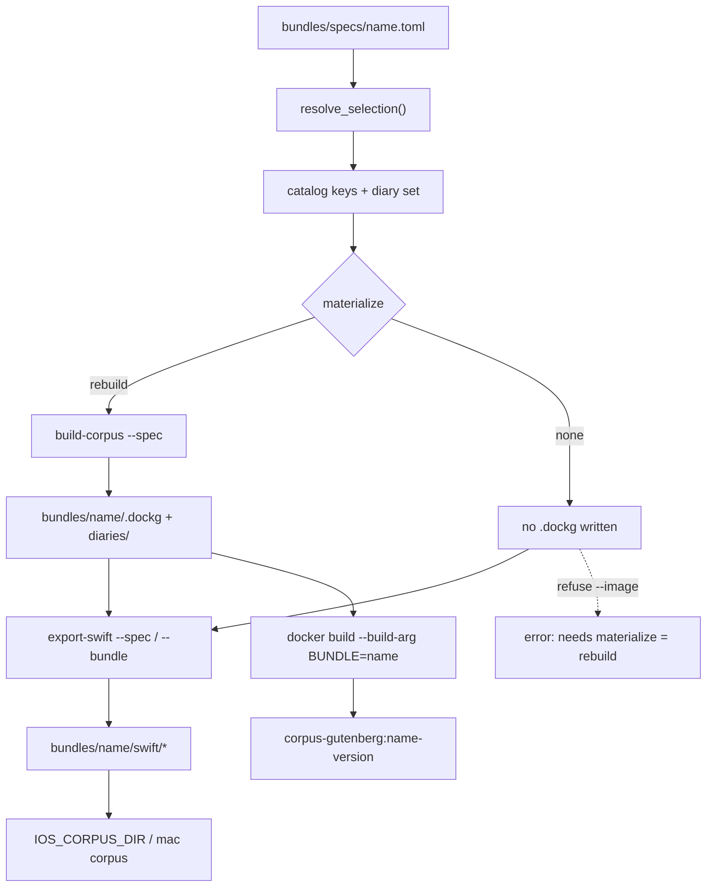

# Selective corpus bundles for Docker and apps

| Field | Value |
|---|---|
| **Author** | Eric G. Suchanek, PhD (Flux-Frontiers) |
| **Date** | 2026-09-05 (rev. 6 -- slice dropped; rebuild is the only materialization) |
| **Status** | Draft |
| **Repo tip** | `main` @ `a2c0cfd` (design first written against `6fb8376`); vector store is `vectors.sqlite` |
| **Workspace** | `/Users/egs/repos/gutenberg_kg` |

---

## Overview

We already have the pieces to ship a subset of the Gutenberg corpus: genre-scoped
DocKG builds (`gutenkg build-corpus --genre ...`), on-device packs
(`gutenkg export-swift --bundle ...`), and a fat Docker image that COPYs a bundle
into `/workspace/gutenberg`. What is missing is a first-class product workflow:
select individual books (not only whole genres), name and version the result,
regenerate the Swift parity gate for that subset, and bake/push without
hand-editing Makefile paths.

This design adds a small **bundle spec** (name, version, selection, diaries
policy, golden queries) and extends the existing CLI surface so one command chain
produces a coherent DocKG bundle, Swift packs, and a tagged container image. The
pack schema, worker layout, and Swift reader stay unchanged.

**What rev. 6 removed.** Rev. 5 carried a second materialization path
(`materialize: slice`) that copied nodes, edges, and vectors out of
`gutenberg-all` instead of re-embedding. It is dropped. It was the largest and
riskiest component in the plan, it required two sub-modes, edge closure over
three relation types, an FTS rebuild on the destination, and it shipped with a
permanent caveat that its output is not identical to a rebuild. The cost it
avoided scales with the subset, not with the corpus, so it was avoiding very
little. See [Deferred: DocKG slice](#deferred-dockg-slice) for the measurement
that would have to come back before reconsidering it.

---

## Background & Motivation

### Current state (verified against `6fb8376`, 2026-09-05)

| Piece | Where | What it does today |
|---|---|---|
| Genre-scoped DocKG | `src/gutenberg_kg/build_corpus.py`, `cli/cmd_build_corpus.py` | Repeatable `--genre`; writes `bundles/<name>/.dockg/` with `graph.sqlite` + `vectors.sqlite` (sqlite-vec). LanceDB is retired: builds purge any leftover `lancedb/` directory. Default name `gutenberg-all` or `gutenberg-<genre>` via `derive_output_name` |
| Catalog | `build_catalog()` | `catalog.json` keyed by `<genre>/<book>`, with `ebook_id`, title, author from `reference.md` |
| Diaries | `bundle_diaries()` | Always copies every `corpus/diaries/*/.diarykg/` into the bundle (no per-bundle opt-in). CLI has `--diaries-only` (re-bundle diaries, skip DocKG phases); there is no `--no-diaries` on `build-corpus` today. `export-swift` already has `--no-diaries` |
| Swift export | `export_swift.py`, `cli/cmd_export_swift.py` | `--bundle` (default `bundles/gutenberg-all`); no book/genre filter; `--no-diaries` exists; writes packs + `manifest.json` + `golden.json` |
| Docker bake | `docker/Dockerfile` L150 | Hard-coded `COPY bundles/gutenberg-all/ /workspace/gutenberg/` |
| Make / apps | `Makefile` | `IOS_CORPUS_DIR ?= bundles/gutenberg-all/swift`; `IMAGE = corpus-gutenberg` tagged `:latest` only. No `export-swift` Make target today; operators run the CLI, and `ios-deploy` only checks that packs exist |
| Docs | `docs/ON_DEVICE.md` | Documents the full-bundle export path |
| Specs path | `.gitignore` L171 | Blanket `bundles/` ignore; no `!bundles/specs/` exception yet |

Measured on this machine after a full `gutenkg build-corpus` on 2026-09-06,
which took **22m 21s** wall clock. That figure anchors every rebuild-cost
estimate below: a subset costs roughly its passage share of it.

| Asset | Size | Notes |
|---|---:|---|
| Full bundle | 5.3 GB | `.dockg` 4.3 GB + diaries 309 MB + swift 743 MB |
| `graph.sqlite` | 3.0 GB | 731,824 nodes, 4,169,384 edges, all kinds |
| `vectors.sqlite` | 1.2 GB | 731,824 vectors, one per node |
| Swift packs (int8) | 680 MB | re-exported 2026-09-07 in 73.2s; 417,016 book + 27,255 diary passages |
| Searchable passages | 385,139 | `kind IN ('chunk','section')` across prose/verse genres |
| Catalog | 253 books | 239 with an author parsed from `reference.md` |

Node kinds, and whether a `file_path` prefix can select them:

| kind | count | `file_path` populated? |
|---|---:|---|
| chunk | 370,772 | yes |
| topic | 171,699 | **no** |
| entity | 130,128 | **no** |
| keyword | 44,360 | **no** |
| section | 14,367 | yes |
| document | 498 | yes |

Edge relations present (no `--similar`, so zero `SIMILAR_TO`):
`MENTIONS_ENTITY` 1,574,099, `HAS_KEYWORD` 1,482,927, `CONTAINS` 385,139,
`HAS_TOPIC` 370,814, `NEXT` 356,405.

Passage share by genre. This scales with **Swift pack** size and, closely
enough, with rebuild time:

| Genre | Passages | Share | Est. rebuild | Est. book pack+vectors |
|---|---:|---:|---:|---:|
| english-literature | 63,313 | 16.44% | ~3m 40s | ~107 MB |
| philosophy | 61,125 | 15.87% | ~3m 33s | ~103 MB |
| ancient-classical | 35,642 | 9.25% | ~2m 4s | ~60 MB |
| shakespeare | 1,357 | 0.35% | ~5s | ~2.3 MB |
| Pride and Prejudice alone | 1,842 | 0.48% | ~6s | ~3 MB |
| Bleak House alone | 4,802 | 1.25% | ~17s | ~8 MB |
| A Christmas Carol alone | 397 | 0.10% | ~1s | ~0.7 MB |

Those rebuild estimates are what retired the slice path: the largest single
genre rebuilds in under four minutes and a one-novel demo in seconds. See
[Deferred: DocKG slice](#deferred-dockg-slice).

Corpus shape relevant to book-level selection (measured 2026-09-05):

- 253 book directories across the 21 genres, **all names unique** (zero
  cross-genre collisions), counted against `ALL_GENRES`.
- **Zero** non-dot subdirectories inside any book directory, so a name-based
  exclusion cannot prune a nested directory by accident.

`vectors.sqlite` schema, which the export filter depends on:

```sql
CREATE TABLE vec_meta(id TEXT PRIMARY KEY, kind TEXT, name TEXT, title TEXT, file_path TEXT);
CREATE VIRTUAL TABLE vec_nodes USING vec0(embedding float[384] distance_metric=cosine);
```

`vec_meta.file_path` is populated for `chunk` / `section` / `document`, so a
prefix filter on the vector stream is directly expressible in SQL.

### Pain points

1. **Book-level selection does not exist.** DocKG `exclude` is directory-name
   based (`doc_kg.dockg.iter_text_files`); `build-corpus` only derives excludes
   for *unselected genres*. There is no `--book` flag.
2. **Product identity is informal.** `gutenberg-philosophy` is a directory name,
   not a versioned product with a stable manifest of contents.
3. **Pipeline seams are manual.** The operator must remember
   `build-corpus --output X`, then `export-swift --bundle bundles/X`, then edit
   `IOS_CORPUS_DIR` / the Dockerfile COPY / the image tag.
4. **Golden queries are corpus-global.** `GOLDEN_QUERIES` in `export_swift.py`
   includes Quran, whale, Hell, electric bell, diary wine. Correct for the full
   pack, wrong as a parity gate for a Dickens-only demo.

---

## Goals & Non-Goals

### Goals

- Select books by catalog key, Gutenberg ID, and/or whole genres into a named,
  versioned **product bundle**.
- Produce the same three consumer artifacts we already ship: DocKG bundle
  (worker/Docker), Swift packs (iOS/macOS), and a tagged container image.
- Prefer composing / extending `build-corpus`, `export-swift`, and Make/Docker
  over inventing a parallel stack.
- Support **filter-at-export** from an existing `gutenberg-all` for Swift packs,
  with no re-embed. This is the one no-rebuild path the design keeps, because it
  reads a store we already trust and writes only packs.
- Diaries opt-in per product bundle.
- Checksums and version tags, so a bad subset can be rolled back without
  touching `gutenberg-all:latest`.

### Non-Goals

- Reimplementing DocKG, sqlite-vec, or the Swift `GutenbergKGKit` reader.
  LanceDB is retired for this corpus; do not plan export paths around a
  `lancedb/` directory.
- **Slicing an existing DocKG.** Dropped in rev. 6; see
  [Deferred: DocKG slice](#deferred-dockg-slice).
- Changing pack schema (`PACK_VERSION = 1`) or worker `GUTENBERG_ROOT` layout.
- CDN / Background Assets distribution for iOS (still deferred per
  `analysis/APP_ARCHITECTURE.md`).
- Per-book federated DocKG (the `ingest` path); product bundles stay
  consolidated.
- Auto-publishing every genre as its own PyPI/Docker artifact.

---

## Key Decisions

1. **Canonical book identity is `<genre>/<book>` (catalog key).**
   Matches `catalog.json`, node `file_path` prefix (`genre/book/file.md`),
   `core.pack` `books.key`, and handler joins. Gutenberg `ebook_id` and bare
   directory names are accepted as *input aliases* and resolved to catalog keys
   before any build or export. Rationale: ebook IDs miss IA/Audels items;
   directory names are unique today (measured) but are not a stable contract.

2. **Product bundles are declared by committed TOML specs under
   `bundles/specs/`; artifacts stay gitignored.**
   Specs use TOML (`tomllib`, stdlib on Python 3.12+) so `bundle_spec.py` needs
   no new runtime dependency. Phase 1 replaces the bare `bundles/` ignore with a
   child-glob so specs can be re-included. Git will not un-ignore files under an
   excluded parent directory, which is verified: `bundles/` plus
   `!bundles/specs/**` still ignores specs, whereas `bundles/*` plus negations
   works.

   ```
   bundles/*
   !bundles/specs/
   !bundles/specs/**
   ```

   Phase 1 acceptance (untracked specs): prefer `git add -n bundles/specs/README.md`
   succeeding, or `git check-ignore -q --no-index bundles/specs/README.md`
   exiting 1. Do **not** use plain `git check-ignore -v` on an untracked path; it
   can exit 0 while printing the negation pattern even when the file is
   addable. Built output stays at `bundles/<name>/`. Rationale: selection is the
   product definition, the multi-GB index is a build artifact, and YAML would
   require declaring `pyyaml` (not a direct dependency today, only transitive
   via the lock).

3. **Extend existing commands; add one thin orchestrator.**
   `--book` / `--spec` on `build-corpus` and `export-swift`, plus `gutenkg
   bundle` as a Click group that chains resolve -> build -> export -> optional
   image bake. Rationale: operators who already know the two commands keep them;
   CI and demos get one entry point.

4. **Two materialization modes: `rebuild` (default) and `none`.**
   - `rebuild` (**default when `materialize` is omitted**): walk the selected
     books via DocKG exclude and embed them. This is the only path that writes
     `bundles/<name>/.dockg/`, and its output is by construction identical to
     what a genre build produces today.
   - `none`: Swift filter-at-export only; no `.dockg/` is written.
     **Incompatible with `bundle image`** (see Decision 8).

   Rationale: one build path means one correctness story. Rebuild cost is
   proportional to the subset, not the corpus: philosophy is 8.4% of the
   vectors, a single novel is under 0.5%. There is no third mode to explain, no
   "which mode did this bundle come from" question at debug time, and no class
   of bug that exists only in bundles built one particular way.

5. **Swift subsets default to filter-at-export from the source bundle.**
   `export-swift --spec ...` (or `--book` / `--genre`) filters catalog,
   passages, and vectors while writing packs. It does not require a pre-built
   subset `.dockg/`. Rationale: apps only need packs, and this avoids a rebuild
   for a phone demo.

   **Phase 2 acceptance criterion (not docs-only):** when `catalog_keys` is set,
   `iter_source_vectors` (or its caller) must apply a `vec_meta.file_path`
   prefix SQL filter for chunk/section rows, so a three-book export does not
   stream all ~731 K source vectors. Tests on a multi-book fixture assert the
   predicate is used, or that vectors read are far below the full store.
   Separately, `--verify` must stream **source fp32** vectors filtered to packed
   ids or path prefixes; the packed sidecar is int8 and is not ground truth for
   the quantisation gate.

6. **Diaries are opt-in per spec; the schema default is `diaries = false`.**
   `gutenberg-all` keeps today's copy-all-diaries behavior through the implicit
   full-corpus path. New `build-corpus --diaries/--no-diaries` is distinct from
   the existing `--diaries-only`, which skips the DocKG phases and only
   re-bundles diary indices. Rationale: diaries are 309 MB DocKG-side and ~31 MB
   packed; most demos do not want them, and `export-swift --no-diaries` already
   exists.

7. **Every named product spec must declare `golden_queries`; there is no
   auto-scope.**
   `golden.json` is always regenerated, from the spec's list verbatim, with a
   minimum of three entries enforced at `bundle validate` time. The implicit
   full-corpus path (`gutenberg-all`, no spec) keeps the module-level
   `GOLDEN_QUERIES` exactly as today.

   Rationale: rev. 5 tried to auto-derive a subset's golden set by keeping global
   queries whose lexical/BM25 channel returned a hit. That was machinery built
   around a filter that cannot work in general: dense and therefore hybrid search
   always returns k neighbours from whatever is packed, so any "did it return
   something" test is vacuous, and the BM25 fallback answers a question
   (do these words appear) that is not the question the gate asks (does this
   corpus answer this query). A product bundle that cannot state three queries it
   is supposed to answer is not ready to ship. Making the list mandatory deletes
   the probe, the survivor threshold, the small-subset special case, and a
   High-severity risk row.

   `--verify` (int8 recall vs source fp32 over packed ids) stays independent of
   golden content.

8. **Image tags: the spec carries the tag suffix; the repository name is fixed.**
   `IMAGE = corpus-gutenberg` stays in the Makefile. The spec field is
   `image_tag`, holding the part **after** the colon, defaulting to
   `{name}-{version}` when omitted:

   ```toml
   image_tag = "philosophy-starter-0.1.0"
   ```

   One resolve helper prints it (`--print-image-tag`), one prints the directory
   name (`--print-bundle-name`). Both Make and `gutenkg bundle image` compose
   `$(IMAGE):$(IMAGE_TAG)` the same way. Rationale: rev. 5 let the spec hold a
   full `corpus-gutenberg:name-version` reference, then needed a third print
   helper, a documented invariant that one of them must never contain `:`, and a
   unit test to enforce it. Storing the suffix makes the double-prefix bug
   unrepresentable. A different registry is a Make variable, not a spec field.

   `corpus-gutenberg:latest` continues to mean `gutenberg-all`. Bare
   `make build BUNDLE=<name>` tags `$(IMAGE):$(BUNDLE)`, unversioned, as local
   convenience only.

9. **`bundle image` requires a materialized DocKG at `bundles/<name>/`.**
   `materialize = "none"` (Swift-only) refuses `--image` with a clear error. An
   image bake never silently COPYs `source_bundle` under a product tag.
   Rationale: the worker reads `GUTENBERG_ROOT/.dockg/graph.sqlite` plus
   `catalog.json`; a packs-only directory is not a worker root.

10. **The rebuild path validates its own file selection.**
    Book-level rebuild works by extending DocKG's directory-name `exclude`, which
    is a global, name-based mechanism. It is safe today (253 unique book names,
    no nested subdirectories), but it is not safe by construction: if two
    *selected* genres ever hold a same-named book and the spec selects only one
    of them by full catalog key, `only_books` keeps both and the unselected book
    is built in silently. So after `iter_text_files` returns and before any
    embedding, assert every path's `<genre>/<book>` prefix is in `catalog_keys`
    and hard-error otherwise. One check, and the hole is closed permanently
    rather than by data that happens to hold.

---

## Proposed Design

### End-to-end flow



### Bundle spec format

Committed example: `bundles/specs/philosophy-starter.toml`

```toml
name = "philosophy-starter"
version = "0.1.0"
description = "Plato, Aristotle, and Kant -- small on-device demo"

# Selection (any combination; resolved to catalog keys)
genres = ["philosophy"]
# books = ["philosophy/The Republic", "2680", "Pride and Prejudice"]

diaries = false   # false (default) | true | list of diary directory names

# Materialization: omit for "rebuild" (the default). "none" = packs only.
materialize = "rebuild"
source_bundle = "bundles/gutenberg-all"   # only read when materialize = "none"

export_swift = true

# Required, minimum 3 entries. Enforced by `bundle validate`.
golden_queries = [
  "the categorical imperative and moral duty",
  "What does Plato say about justice?",
  "the allegory of the cave",
]

# Tag suffix only; the repository name is always corpus-gutenberg.
image_tag = "philosophy-starter-0.1.0"
```

A Swift-only demo, no Docker:

```toml
name = "austen-dickens"
version = "0.1.0"
books = [
  "english-literature/Pride and Prejudice",
  "english-literature/Bleak House (Dickens)",
]
diaries = false
materialize = "none"           # packs only; bundle image will refuse
source_bundle = "bundles/gutenberg-all"
export_swift = true
golden_queries = [
  "a dinner party in Hertfordshire",
  "Jarndyce and Jarndyce",
  "Mr. Darcy",
]
```

(Dickens titles in the corpus today: Bleak House, David Copperfield, and
A Christmas Carol, which PR #109 added on 2026-09-04.)

### Resolution: `resolve_selection()`

New module: `src/gutenberg_kg/bundle_spec.py`, stdlib only (`tomllib`,
`dataclasses`, `pathlib`, `json`) plus the existing `parse_reference` / catalog
helpers. No PyYAML.

```python
@dataclass(frozen=True)
class BundleSpec:
    name: str
    version: str
    genres: tuple[str, ...]
    books: tuple[str, ...]          # raw inputs
    diaries: bool | tuple[str, ...] # default False
    source_bundle: Path
    materialize: str                # rebuild | none; default "rebuild"
    golden_queries: tuple[str, ...] # required, >= 3 entries
    image_tag: str                  # suffix only; default f"{name}-{version}"
    export_swift: bool = True
    description: str = ""

@dataclass(frozen=True)
class ResolvedSelection:
    catalog_keys: frozenset[str]    # "genre/book"
    genres_implied: frozenset[str]  # {k.split("/", 1)[0] for k in catalog_keys}
    diary_dirs: tuple[str, ...]     # empty => no diaries
    missing: tuple[str, ...]        # unresolved inputs (hard error)
```

Resolution rules, in order, for each `books:` entry:

1. If it contains `/` and matches a corpus `reference.md` parent, it is a
   catalog key.
2. If it is all digits, scan `corpus/*/reference.md` for `ebook_id` (the same
   approach as `gutenberg._find_book_by_id`, but across all genres).
3. If it matches exactly one book directory name under `corpus/<genre>/`, take
   that key.
4. Otherwise record it in `missing` and fail the command. No fuzzy title search
   in v1: `gutenkg quilt --book` fuzzy matching is a different UX and too easy to
   mis-resolve in a product spec.

`--genre` on the CLI unions all books under that genre into `catalog_keys`.
Ambiguous bare directory names (the same name in two genres) hard-error at
resolve time.

Validation performed by `bundle validate`:

- `materialize` in `{"rebuild", "none"}`.
- `len(golden_queries) >= 3`.
- `image_tag` contains no `:` and no `/`.
- Every `books:` / `genres:` entry resolves; `missing` is empty.
- Book paths resolve strictly under `CORPUS_ROOT`; `..` and absolute paths are
  rejected.
- `materialize = "none"` implies `export_swift = true` (otherwise the spec
  produces nothing).

### Extending `build-corpus`

Add to `BuildCorpusOptions` / Click:

| Flag | Effect |
|---|---|
| `--book TEXT` (repeatable) | Resolve to catalog keys; include only those books |
| `--spec PATH` | Load `BundleSpec`; implies output name, books/genres, diaries policy |
| `--diaries / --no-diaries` | Override diary bundling for this run. **Distinct from** the existing `--diaries-only`, which skips phases 1-3 and only re-bundles diary indices. `--diaries-only` is unchanged |

Call site for a book-level rebuild. Genres come from the resolved keys, not from
the optional `genres:` list:

```python
catalog_keys = resolved.catalog_keys
genres = sorted({k.split("/", 1)[0] for k in catalog_keys})
only_books = {k.split("/", 1)[1] for k in catalog_keys}
exclude = derive_exclude(genres, only_books=only_books)
```

Today `derive_exclude(genres)` returns unselected genre directory names. Extend
it to:

```python
def derive_exclude(
    genres: list[str],
    *,
    only_books: set[str] | None = None,  # directory names to keep
) -> set[str]:
    ...
    if only_books is not None:
        # Within selected genres, exclude sibling book directories not kept.
        for genre in genres:
            for child in (CORPUS_ROOT / genre).iterdir():
                if child.is_dir() and child.name not in only_books and not child.name.startswith("."):
                    exclude.add(child.name)
    return exclude
```

Then, per Decision 10, verify the walk actually produced what was asked for:

```python
def assert_selection(files: list[Path], catalog_keys: frozenset[str]) -> None:
    """Hard-error if the name-based exclude let an unselected book through.

    :param files: Paths returned by ``doc_kg.dockg.iter_text_files``.
    :param catalog_keys: The resolved ``<genre>/<book>`` selection.
    :raises BuildError: If any walked file lies outside the selection.
    """
    stray = sorted(
        {"/".join(f.relative_to(CORPUS_ROOT).parts[:2]) for f in files} - catalog_keys
    )
    if stray:
        raise BuildError(f"exclude leaked {len(stray)} unselected book(s): {stray[:5]}")
```

Cheap (a set difference over the file list), and it converts a silent
wrong-contents build into a hard failure before any embedding happens.

Also in this PR:

- `build_catalog` filters to the resolved catalog keys, not to every book in the
  selected genres.
- `bundle_diaries` gains an optional allow-list of diary directory names; an
  empty allow-list means skip, which is the product default.
- `derive_output_name`: with `--spec`, use `spec.name`. With `--book` and no
  `--output`, refuse to invent a name so an ad-hoc pick cannot silently
  overwrite `gutenberg-all`. Refuse book-filtered builds targeting
  `gutenberg-all` without `--force-overwrite-full`.

### Extending `export-swift` (filter-at-export)

Add to `ExportOptions`:

```python
catalog_keys: frozenset[str] | None = None  # None => all books in catalog
genres: frozenset[str] | None = None
diary_dirs: tuple[str, ...] | None = None   # alongside existing include_diaries
golden_queries: tuple[str, ...] | None = None
```

CLI:

```
gutenkg export-swift --bundle bundles/gutenberg-all \
  --book "english-literature/Pride and Prejudice" \
  --book "english-literature/Bleak House (Dickens)" \
  --out bundles/austen-dickens/swift \
  --no-diaries --verify --force

gutenkg export-swift --spec bundles/specs/philosophy-starter.toml --verify
```

Filter points:

1. `build_core_pack`: skip catalog rows whose key is outside `catalog_keys`.
2. `iter_source_passages` / `build_passage_pack`: keep passages whose
   `split_source_path(file_path)` maps to an allowed key. Diaries are handled
   via `include_diaries` and the allow-list.
3. Vector sidecar: write only vectors for kept passage ids. **Phase 2 required:**
   when `catalog_keys` is set, filter `iter_source_vectors` with
   `vec_meta.file_path` prefix predicates for chunk/section rows. Enrichment
   kinds never reach the pack. Acceptance test: a multi-book fixture asserts the
   filter is applied and that vectors read are far below the full store. Without
   this, a three-book export still streams ~731 K rows.
4. `build_golden`: write the spec's `golden_queries` verbatim (Decision 7). With
   no spec, keep today's module-level `GOLDEN_QUERIES`.
5. `_manifest`: add a nested
   `"product": {"name", "version", "catalog_keys_sha256", "book_count"}`.
   Verified safe for Swift: `PackManifest` in
   `app/GutenbergKGKit/.../CorpusPacks.swift` is `Codable` with an explicit
   `CodingKeys` set, and Foundation's `JSONDecoder` ignores keys not listed.
   Nested `product` is hygiene, not required for decode compatibility. No pack
   schema version bump.
6. Destination hygiene: when `--out` already holds packs, wipe it before
   writing, behind the existing `--force`. Otherwise shrinking a spec's book set
   leaves orphaned pack files next to the new ones.

`--verify` remains int8 pack dense search against **source fp32** ground truth
over the packed id set. For subset exports, stream and filter *source* vectors
by packed ids or `vec_meta.file_path` prefixes; do not treat the packed int8
sidecar as ground truth. Document that an unfiltered full-source load is still
expensive (a 1 GB+ float matrix).

### Orchestrator: `gutenkg bundle`

```
gutenkg bundle validate <spec>
gutenkg bundle resolve  <spec> [--print-bundle-name|--print-image-tag]
    # default: catalog keys, size and rebuild-time estimates, exit 0/1
gutenkg bundle build    <spec> [--force]      # no-op when materialize = "none"
gutenkg bundle export   <spec> [--verify]
gutenkg bundle image    <spec>                # requires bundles/<name>/.dockg/
gutenkg bundle make     <spec> [--verify] [--image]
    # validate -> build (skipped for materialize:none) -> export
    # --image refused when materialize:none or .dockg missing
```

`bundle make` is the coherent pipeline. It does not replace the Make targets; it
is what the new Make targets call.

### Makefile / Docker wiring

Today `build` runs `docker build ... -t $(IMAGE):latest .` (and the Apple
`container build` equivalent), and there is **no** `export-swift` Make target.
Proposed new variables and targets, with defaults that preserve today's
full-corpus behavior:

```make
# NEW vars -- defaults keep gutenberg-all / :latest
SPEC        ?=
BUNDLE      ?= gutenberg-all
IMAGE_TAG   ?= $(if $(filter gutenberg-all,$(BUNDLE)),latest,$(BUNDLE))

# With SPEC=, resolve inside the recipe, not at parse time: a `:=` $(shell ...)
# would run the resolver on every make invocation, `make help` included.
define resolve_spec
$(if $(SPEC),\
  BUNDLE=$$($(GUTENKG) bundle resolve --print-bundle-name $(SPEC)); \
  IMAGE_TAG=$$($(GUTENKG) bundle resolve --print-image-tag $(SPEC)); ,\
  BUNDLE=$(BUNDLE); IMAGE_TAG=$(IMAGE_TAG); )
endef

# existing build-corpus target -- optional SPEC passthrough
build-corpus: build-diaries
	$(GUTENKG) build-corpus $(if $(SPEC),--spec $(SPEC),)

# NEW target
export-swift:
	@$(resolve_spec) \
	$(GUTENKG) export-swift --bundle bundles/$$BUNDLE --verify --force

# CHANGED tag line (today: -t $(IMAGE):latest, on both Docker and Apple branches)
build: check-pins
	@$(resolve_spec) \
	docker build $(BUILD_FLAGS) $(HF_SECRET) -f docker/Dockerfile \
	  --build-arg BUNDLE=$$BUNDLE -t $(IMAGE):$$IMAGE_TAG .
```

`make build BUNDLE=philosophy-starter` gives `corpus-gutenberg:philosophy-starter`
(convenience, unversioned).
`make build SPEC=bundles/specs/philosophy-starter.toml`, or
`gutenkg bundle image ...`, gives
`corpus-gutenberg:philosophy-starter-0.1.0` (canonical).

Dockerfile:

```dockerfile
ARG BUNDLE=gutenberg-all
COPY bundles/${BUNDLE}/ /workspace/gutenberg/
LABEL org.fluxfrontiers.gutenberg.bundle="${BUNDLE}"
```

Compose keeps `image: corpus-gutenberg:latest` for local full-corpus dev.
Product demos:

```sh
gutenkg bundle make bundles/specs/philosophy-starter.toml --verify --image
# tags corpus-gutenberg:philosophy-starter-0.1.0 -- never retags :latest
```

While phase 4 is in the Docker context anyway: `.dockerignore`'s `**/lancedb` block
carries a stale comment claiming `build-corpus` does not delete a pre-migration
`lancedb/` directory. It does now (`build_corpus.py` purges it). Keep the
ignore, fix the comment.

### App install path

No Swift code change is required for v1 as long as packs land in the same
layout. Operators:

```sh
make ios-deploy BUNDLE=philosophy-starter
# or
IOS_CORPUS_DIR=bundles/philosophy-starter/swift make ios-deploy
```

Optional follow-up, not mandatory scope here: show `manifest.product.name` and
version in Settings > Corpus.

---

## API / Interface Changes

### Before

```sh
gutenkg build-corpus --genre philosophy --output gutenberg-philosophy
gutenkg export-swift --bundle bundles/gutenberg-philosophy --verify
# hand-edit Dockerfile COPY + Makefile IOS_CORPUS_DIR
docker build -f docker/Dockerfile -t corpus-gutenberg:latest .
```

### After

```sh
# Product path (preferred)
gutenkg bundle make bundles/specs/philosophy-starter.toml --verify --image

# Equivalent expanded form
gutenkg build-corpus --spec bundles/specs/philosophy-starter.toml
gutenkg export-swift --spec bundles/specs/philosophy-starter.toml --verify
gutenkg bundle image bundles/specs/philosophy-starter.toml

# Ad-hoc Swift subset from the full bundle (no rebuild, no image)
gutenkg export-swift \
  --bundle bundles/gutenberg-all \
  --book "english-literature/Pride and Prejudice" \
  --book "english-literature/Bleak House (Dickens)" \
  --out bundles/austen-dickens/swift \
  --no-diaries --verify --force
make ios-deploy IOS_CORPUS_DIR=bundles/austen-dickens/swift
```

### Python surface

```python
# gutenberg_kg.bundle_spec
load_spec(path: Path) -> BundleSpec          # TOML via tomllib
resolve_selection(spec: BundleSpec, *, corpus_root: Path = CORPUS_ROOT) -> ResolvedSelection
estimate_size(selection: ResolvedSelection, source: Path) -> SizeEstimate

# BuildCorpusOptions additions
books: list[str] = field(default_factory=list)
spec_path: Path | None = None
include_diaries: bool = True
diary_dirs: list[str] | None = None

# ExportOptions additions
catalog_keys: frozenset[str] | None = None
genres: frozenset[str] | None = None
diary_dirs: tuple[str, ...] | None = None
golden_queries: tuple[str, ...] | None = None
```

---

## Data Model Changes

### New committed files

```
bundles/specs/                  # un-ignored via the .gitignore exception in phase 1
  README.md
  philosophy-starter.toml
  shakespeare-demo.toml
```

### Bundle directory (unchanged layout, plus a sidecar)

```
bundles/<name>/
  .dockg/                       # absent when materialize = "none"
    graph.sqlite
    vectors.sqlite
    catalog.json
  diaries/                      # optional
  swift/                        # export-swift output
  product.json                  # NEW: frozen resolved selection + checksums
```

`product.json`:

```json
{
  "name": "philosophy-starter",
  "version": "0.1.0",
  "spec_sha256": "...",
  "materialize": "rebuild",
  "catalog_keys": ["philosophy/The Republic", "..."],
  "book_count": 12,
  "diary_dirs": [],
  "created": "2026-09-05T12:00:00+00:00",
  "dockg_sha256": { "graph.sqlite": "...", "vectors.sqlite": "...", "catalog.json": "..." }
}
```

A rollback and audit record only. Neither the worker nor the Swift reader reads
it.

### Migration

No migration of the existing `gutenberg-all`. Specs are additive. The old
genre-only commands keep working.

---

## Alternatives Considered

### A. Spec-only orchestrator, no CLI filter flags

Only `gutenkg bundle make --spec`. Rejected as the sole interface: "pack these
two books onto the phone" is a real workflow and should not require writing a
TOML file first. The spec stays the product path; the flags stay for one-offs.

### B. DocKG slice instead of rebuild (rev. 5's `materialize: slice`)

Copy filtered nodes, edges, and vectors out of `gutenberg-all` rather than
re-embedding. **Rejected in rev. 6.** See
[Deferred: DocKG slice](#deferred-dockg-slice) for the full accounting and the
measurement that would reopen it.

### C. Symlink forest / staging corpus for book selection

Instead of extending `derive_exclude`, stage
`bundles/<name>/_src/<genre>/<book> -> corpus/...` and point DocKG at `_src`.

**This does not work as written.** `doc_kg.dockg.iter_text_files` uses
`os.walk(corpus_root)` with the default `followlinks=False`, so a symlinked book
*directory* is never descended into and the build would come out empty. A
staging forest would have to symlink individual files, or doc_kg would need a
`followlinks=True` change. Given that, plus Decision 10's validation check
closing the actual hole for the cost of a set difference, this stays deferred.

### D. New pack format / multiple corpora inside one app install

Out of scope. The app opens one corpus directory. Side-by-side products are
side-by-side directories and image tags.

### E. YAML specs vs TOML/JSON

YAML is nicer to hand-edit, but `pyyaml` is not a direct runtime dependency
(`pyproject.toml` stops at click / kgmodule-utils / rich / doc-kg / diary-kg /
hf-transfer; PyYAML arrives only transitively). **Accepted: TOML via stdlib
`tomllib`.** JSON remains fine for machine-generated specs; not required in v1.

### F. Auto-scoped golden queries (rev. 5's Decision 7)

Keep a global `GOLDEN_QUERIES` entry for a subset when its lexical/BM25 channel
returns at least one hit, hard-failing under three survivors. **Rejected in rev.
6** in favour of mandatory explicit lists (Decision 7). The auto-scope rule was
built around the fact that no dense or hybrid signal can express "this query
does not belong to this corpus", which left BM25 term presence as a proxy for a
question it does not answer.

---

## Deferred: DocKG slice

Rev. 5 specified `materialize: slice`: a `bundle_slice.py` that copies
`document` / `chunk` / `section` nodes and their vectors out of
`gutenberg-all/.dockg/` into a product bundle, with a `served` mode (searchable
kinds only) and a `graph` mode (plus edge closure over `MENTIONS_ENTITY` /
`HAS_TOPIC` / `HAS_KEYWORD`, since those kinds carry NULL `file_path` and cannot
be selected by prefix), an FTS5 rebuild on the destination, and a filtered
`catalog.json`.

Why it is out:

- **It buys little.** The rebuild it avoids is proportional to the subset.
  Philosophy is 8.4% of the store, a single novel under 0.5%. Slice's own
  estimate was "single-digit minutes", against a subset rebuild in the same
  range.
- **It never fully matched a rebuild.** Cross-book entity merges differ, so
  `graph` mode was documented as "usable" but not equivalent, and `served` mode
  drops enrichment entirely. That is a caveat every downstream consumer of a
  product bundle would have had to carry forever.
- **It doubles the debugging surface.** Every bug report against a product
  bundle would start with "which mode built this".
- **It was most of the risk.** Two of the largest risk rows in rev. 5, plus a
  dedicated PR with fixture tests asserting node-kind counts, existed only to
  serve it.

**Measured, 2026-09-06: the case is closed.** A full 253-book
`gutenkg build-corpus` takes 22m 21s. Philosophy is 15.87% of the passages, so
a philosophy-only rebuild is roughly 3m 33s, and a one-novel demo is seconds.
The threshold set for reopening this was a 16%-of-corpus rebuild costing north
of 15 minutes; the real figure is a quarter of that. Slice would have traded a
permanent correctness caveat for about three minutes.

It would take a corpus several times this size, or an embedder several times
slower, to put the question back on the table. If that happens, it should come
back as `served` mode only: `graph` mode's edge closure was the bulk of the
complexity for the least-used output.

---

## Security & Privacy Considerations

| Topic | Notes |
|---|---|
| Content | Public-domain corpus text, redistributable. Still treat bundles as release artifacts with SHA-256 in `manifest.json` / `product.json` |
| Secrets | No change: the HF token stays a BuildKit secret (`Makefile` `HF_SECRET`). Never bake tokens into subset images either |
| Supply chain | Spec files are committed review surface. A bad `--book` cannot pull network content; it can only select from the local `corpus/` tree |
| Path traversal | Resolve book paths strictly under `CORPUS_ROOT`; reject `..` and absolute paths in specs |
| Image confusion | Do not retag product images as `:latest`. Rollback = run the previous `:name-version` tag. `materialize = "none"` cannot bake an image that secretly COPYs the full corpus |

The threat model is low (local/dev, public-domain content). The main failure mode
is **shipping the wrong subset labeled as the full corpus**, mitigated by the tag
policy, `product.json`, the manifest `product` block, and Decision 10's
selection assertion.

---

## Observability

- `bundle resolve` prints: key count, per-genre counts, estimated rebuild time
  (from passage share against the last full-build timing), estimated Swift MB,
  diaries yes/no, and residual `--verify` cost notes.
- Progress lines gain `product: name@version (N books, materialize=...)`.
- `export-swift --verify`: fail the orchestrator if recall < 0.9 under
  `bundle make`.
- Optional: write `reports/bundle_<name>_<timestamp>.md`, following the
  `reports/ingest_*.md` pattern.

CI gate: `bundle validate` on every spec under `bundles/specs/`, plus a smoke
`export-swift --no-vectors --no-golden` for one tiny fixture spec in tests.

---

## Rollout Plan

One branch, one PR. The work is phased internally and each phase is finished and
green before the next starts, but nothing lands piecemeal: the pieces are only
coherent together, and a half-landed spec layer with no consumer is dead code on
`develop`.

| Phase | Scope | Done when |
|---|---|---|
| 1 | Spec + resolve | `bundle validate` and `bundle resolve` run against the two example specs; `git add -n bundles/specs/README.md` succeeds |
| 2 | export-swift filters | Three-book export produces packs; the vector filter test shows reads far below the full store |
| 3 | build-corpus `--book` / `--spec` / `--no-diaries` | `philosophy-starter` rebuilds; the selection guard fires on a forced-collision fixture |
| 4 | Docker ARG, Make wiring, `bundle make` / `bundle image` | Fixture bundle bakes and runs; `materialize = "none"` refuses `--image` |
| 5 | Docs + example specs | ON_DEVICE / CHEATSHEET / BUNDLES updated with the measured numbers from phase 3 |

Feature flags: none required. Filter-at-export is an explicit flag or spec field,
and the defaults preserve `gutenberg-all` behavior.

### Rollback if a bad subset ships

- **Images:** run the previous `corpus-gutenberg:<name>-<prior-version>`; leave
  `:latest` (full corpus) alone.
- **Device packs:** `make ios-deploy IOS_CORPUS_DIR=bundles/gutenberg-all/swift`
  restores the full pack; the app refuses a mismatched embedder via the existing
  manifest check.
- **Bad spec:** revert the TOML in git; artifacts under `bundles/<name>/` are
  disposable (`rm -rf`).
- **Wrong contents suspected:** re-run `bundle build` and diff `catalog.json`
  plus passage counts against `product.json`. Do not delete `gutenberg-all`
  while debugging.

---

## Risks

| Risk | Severity | Mitigation |
|---|---|---|
| Name-based exclude admits an unselected book | Medium (impossible today: 253 unique names) | Decision 10: assert every walked file's `<genre>/<book>` prefix is in `catalog_keys` before embedding; hard-error on ambiguous bare names at resolve time |
| Filter-at-export full-scans 731 K vectors | Medium | Phase 2 **must** ship the `vec_meta.file_path` filter (acceptance test); document residual verify cost; `bundle resolve` warns |
| Make name-only tag vs spec `name-version` drift | Low | Decision 8: `SPEC=` and `bundle image` both resolve `--print-image-tag`; bare `BUNDLE=` documented as unversioned convenience |
| `materialize = "none"` + `--image` COPYs the wrong tree | High | Decision 9: refuse an image bake without `bundles/<name>/.dockg/` |
| Dockerfile `COPY bundles/${BUNDLE}` surprises via `.dockerignore` | Medium | Smoke-build a tiny fixture bundle image in phase 4 |
| Accidental overwrite of `gutenberg-all` via a book filter | High | Refuse book-filtered builds targeting `gutenberg-all` without `--force-overwrite-full` |
| Stale packs left behind when a spec's book set shrinks | Medium | Wipe the `--out` directory under `--force` before writing (phase 2) |
| Operator points `:latest` at a demo image | Medium | Tag policy; `bundle image` never writes `:latest` unless the spec name is `gutenberg-all` |
| Confusing `--no-diaries` with `--diaries-only` | Low | CLI help text calls out the distinction; `--diaries-only` semantics unchanged |

---

## Open Questions

1. ~~Spec path / gitignore~~ **Closed:** `bundles/*` plus `!bundles/specs/` and
   `!bundles/specs/**` in phase 1 (not bare `bundles/`); TOML; acceptance via
   `git add -n` or `git check-ignore -q --no-index`.
2. ~~Diary default for genre-only specs~~ **Closed:** `diaries = false` is the
   schema default for any named product spec; the implicit full-corpus path
   keeps copy-all.
3. ~~Golden empty-hit policy~~ **Closed:** Decision 7 -- explicit
   `golden_queries`, minimum 3, no auto-scope.
4. ~~`materialize: none` as first-class~~ **Closed:** yes in specs from phase 2;
   `bundle image` refuses it (Decision 9).
5. ~~Slice modes~~ **Closed:** slice is dropped entirely (rev. 6).
6. **IA / Audels books have no Gutenberg `ebook_id`. Is the catalog key the only
   supported identity there?** Yes in v1; confirm no desire for IA identifier
   aliases yet.
7. **Should the `product` manifest block appear in the Swift Settings UI in the
   same release train, or docs-only for v1?** Recommendation: docs-only; the UI
   is a separate app PR.
8. **Image registry naming:** local tags only, or also define
   `egsuchanek/corpus-gutenberg:<name>-<version>` push conventions?
   Recommendation: local tags in this doc; push policy stays with the RunPod and
   release docs.

---

## References

- `src/gutenberg_kg/build_corpus.py` -- `derive_output_name`, `derive_exclude`, `build_catalog`, `bundle_diaries`, `run_build_corpus`
- `src/gutenberg_kg/cli/cmd_build_corpus.py` -- `--genre`, `--output`, `--diaries-only`, `--update`
- `src/gutenberg_kg/export_swift.py` -- `ExportOptions`, `export_swift`, `GOLDEN_QUERIES`, `build_golden`, `verify_pack`, `search_pack`, `iter_source_passages`, `iter_source_vectors`, pack schemas
- `src/gutenberg_kg/cli/cmd_export_swift.py` -- `--bundle`, `--no-diaries`, `--verify`
- `src/gutenberg_kg/serve/handler.py` -- `GUTENBERG_ROOT`, catalog joins, `_semantic_search`
- `app/GutenbergKGKit/Sources/GutenbergKGKit/Retrieval/CorpusPacks.swift` -- `PackManifest` CodingKeys (unknown JSON keys ignored)
- `docker/Dockerfile` L150 -- `COPY bundles/gutenberg-all/`
- `.dockerignore` -- `**/lancedb`, `**/embeddings.jsonl` (stale lancedb comment; fix in phase 4)
- `Makefile` -- `build-corpus`, `build` (`-t $(IMAGE):latest`), `IOS_CORPUS_DIR` (no `export-swift` target today)
- `.gitignore` L171 -- `bundles/` (phase 1 changes it to `bundles/*` plus specs negations)
- `doc_kg/src/doc_kg/dockg.py` -- `iter_text_files` (`os.walk`, `followlinks=False`), `SKIP_DIRS`, `exclude` semantics
- `docs/ON_DEVICE.md` -- pack layout and parity gate
- `analysis/APP_ARCHITECTURE.md` -- why packs omit the graph
- `analysis/STRUCTURAL_PARSER_PLAN.md`, `analysis/MONOLITHIC_SECTIONS_PLAN.md` -- prior design-doc voice
- `scripts/build_corpus_by_genre.py` -- genre-at-a-time assembly precedent

---

## Implementation Plan

Single branch `feat/selective-bundles`, single PR. Phases run in order; each is
tested and green before the next begins.

### Phase 1 -- Bundle spec model and resolver

- `src/gutenberg_kg/bundle_spec.py` (new, TOML via `tomllib`)
- `src/gutenberg_kg/cli/cmd_bundle.py` (new: `validate`, `resolve`, with
  `--print-bundle-name` and `--print-image-tag`)
- `src/gutenberg_kg/cli/main.py` (register the group)
- `tests/test_bundle_spec.py`
- `.gitignore`: `bundles/` becomes `bundles/*` plus `!bundles/specs/` and
  `!bundles/specs/**`; add `bundles/specs/README.md`

Define the TOML schema; resolve `genre/book`, ebook_id, and unique directory
names to catalog keys; refuse ambiguous names; validate `materialize`, the
3-query golden minimum, and `image_tag` shape; print size and rebuild-time
estimates from an optional source bundle. No build or export behavior change,
and no new runtime dependency. The gitignore check uses `git add -n` or
`git check-ignore -q --no-index`, not plain `check-ignore -v` on an untracked
path.

### Phase 2 -- Filter-at-export for Swift packs

- `src/gutenberg_kg/export_swift.py`: catalog / passage / vector filters, spec
  golden queries verbatim, the **required** `vec_meta.file_path` scan filter,
  nested manifest `product`, `--force` destination wipe, verify streaming
  filtered source fp32
- `src/gutenberg_kg/cli/cmd_export_swift.py`: `--book`, `--genre`, `--spec`
- `tests/test_export_swift.py`: multi-book fixture asserting the filter is
  applied and vectors read are far below the full store
- `cmd_bundle.py`: `bundle export`

Pack schema stays at version 1. This is the phase that makes phone demos
possible with no rebuild, so it is worth stopping here to actually export
`austen-dickens` and put it on a device before moving on.

### Phase 3 -- Book-level `build-corpus` and diary opt-in

- `src/gutenberg_kg/build_corpus.py`: `derive_exclude` book filter with the
  genres-from-keys call site, the `assert_selection` guard, `build_catalog`
  filter, `bundle_diaries` allow-list, `product.json` writer
- `cli/cmd_build_corpus.py`: new `--diaries/--no-diaries`; `--diaries-only`
  unchanged
- Tests including a fixture that forces a cross-genre name collision and asserts
  the guard fires
- Refuse book-filtered writes to `gutenberg-all` without
  `--force-overwrite-full`

Full-corpus default unchanged. Record the measured wall time for a
`--genre philosophy` build in this document while here; it is the number the
slice deferral hinges on.

**Measured for real, 2026-09-07, on Turing:** `gutenkg build-corpus --genre
philosophy` (39 books, 144,046 nodes, 615,559 edges, 725.4 MB index)
completed in **2m 38s**. [Deferred: DocKG slice](#deferred-dockg-slice)
closed this question on 2026-09-06 against an *estimate* derived
proportionally from the full-corpus build time (15.87% of the corpus →
~3m 33s). This is the estimate checked against a real run, on the actual
phase-3 code path (`--book`/`--genre` filtering, not the plain `--genre`
this repo already had) rather than a proportional guess — and it lands
faster than the estimate, reinforcing rather than reopening that
deferral.

### Phase 4 -- Docker / Make parameterization and `bundle make`

- `docker/Dockerfile`: `ARG BUNDLE`, `LABEL`
- `Makefile`: new `BUNDLE` / `SPEC` / `IMAGE_TAG` and an `export-swift` target;
  change `-t $(IMAGE):latest` to the resolved tag and pass
  `--build-arg BUNDLE=` on both the Docker and Apple `container` build lines;
  resolve inside recipes, not with `:=`
- `.dockerignore`: fix the stale lancedb comment
- `cmd_bundle.py`: `make`, `image`, refusing without `.dockg/`
- Smoke-build a tiny fixture bundle image

Implements Decision 8 (the spec holds the tag suffix) and Decision 9
(`materialize = "none"` plus `--image` is an error). `:latest` stays
`gutenberg-all`.

### Phase 5 -- Example specs and documentation

- `docs/ON_DEVICE.md`, `docs/CHEATSHEET.md`, a short `docs/BUNDLES.md`
- `bundles/specs/philosophy-starter.toml`, `bundles/specs/shakespeare-demo.toml`
- README pointer

End-to-end operator docs with the measured size and rebuild-time tables from
phase 3, tag policy, rollback, the golden-query requirement, and
filter-at-export vs rebuild.
